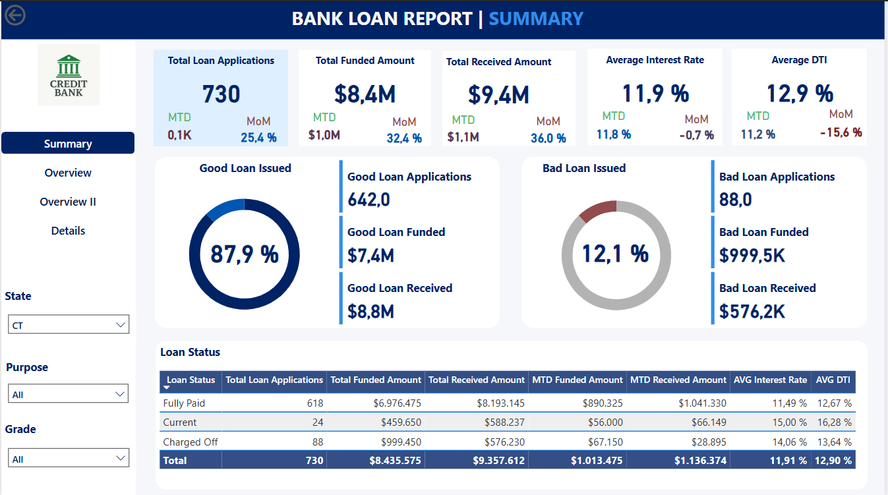
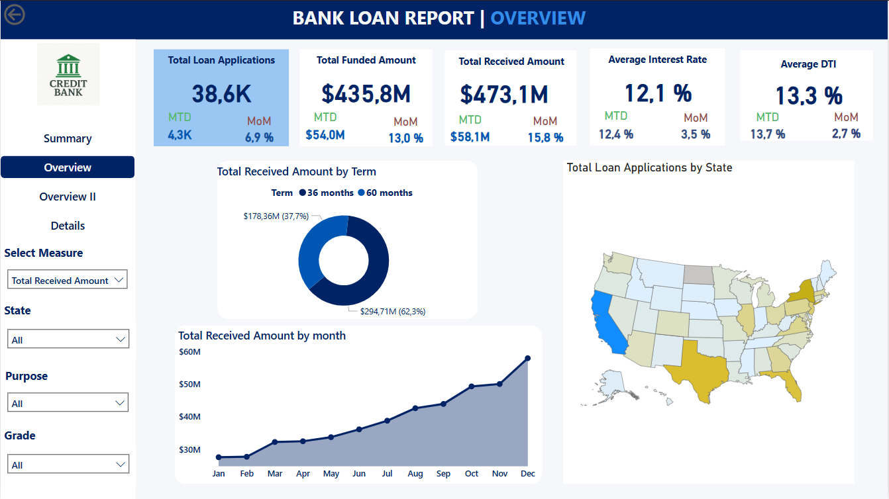
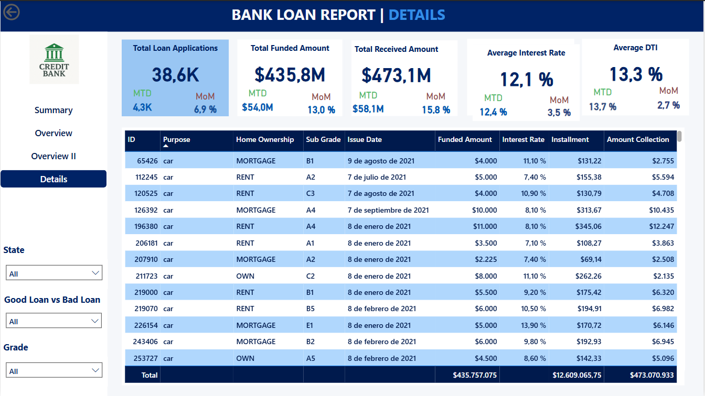

# Bank-Loan-Analysis
Caso de Estudio Análisis cartera de créditos bancarios con SQL y Power BI

# 🏦 Análisis de Préstamos Bancarios  

## 📌 Descripción  
Proyecto de análisis de datos para evaluar el desempeño de préstamos bancarios, utilizando:  
- **SQL Server**: consultas y calculos de las valores para contrastarlos con los calculos en Power BI.  
- **Power BI**: Se crearon las Measure y se compararon con los resultados en SQL, Visualización de datos.  

## 📊 Contenido  
- [Documentación del caso de estudio](Bank_Loan_Problem_Statement.docx)  
- [Queries SQL utilizados](Query_SQL_Server_Kenin.docx)  
- Dashboards de Power BI:  
    
    
  
  
  
## 🔍 Hallazgos Clave  
1. El 13.8% de los préstamos están en mora (*charged off*) clasificados como Bad Loan.  
2. Los préstamos para "debt consolidation" representan mas del 40% del total.
3. California es el Estado con mayor cantidad de Prestamos
4. Durante todo el año 2021 hay un incremento constante del total de pagos de prestamos recibidos
5. El promedio total de la tasa de interes de esta cartera de creditos es del 12.1 %
6. La gran mayoria de solicitantes de creditos no posee vivenda propia o estan bajo hipoteca.

## 🛠️ Cómo Replicar el Proyecto  
1. Ejecutar los queries SQL en tu servidor.  
2. Importar los datos a Power BI.  

## ✉️ Contacto  
¡Conectemos en [[LinkedIn](https://www.linkedin.com/in/kenin-vizcaya-paredes-0b2a3310a/)!  
